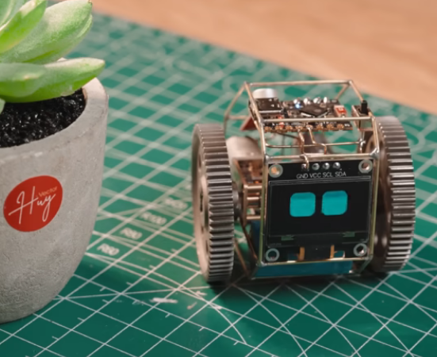
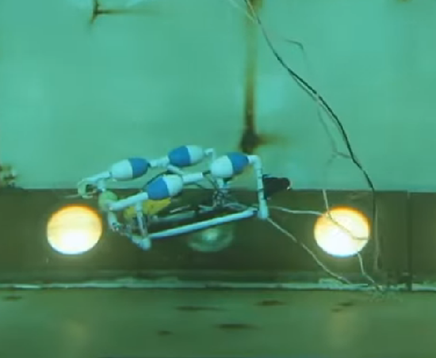
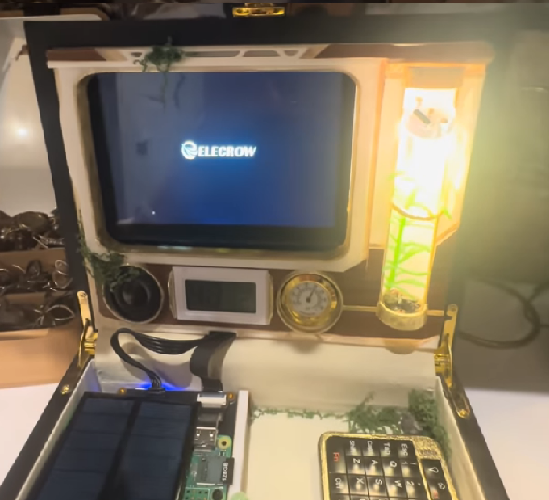
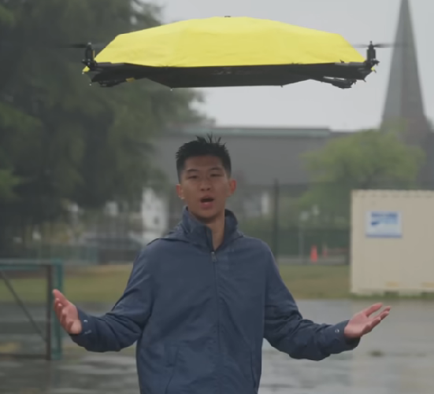

  

 

# Hello! I'm Kelly 🌱
Current UCSD student interested in *embedded systems, robotics, and low level system design*. Currently, I am an undergraduate reasearcher with UCSD working on bioacustic visualization using AI/ML, [see here](https://github.com/UCSD-E4E/acoustic_knowledge_discovery). I love meshing technology and art to make unique pieces of tech which are functional and beautiful. My hobbies are art and music, and my favorite color combination is a classic complementary blue and orange. 

 ⋆｡°✩°｡⋆

> “Create with the heart; build with the mind.” – Criss Jami

## Quick Links
1. [Title Card](#hello-im-kelly-)    
2. [Projects](#projects)    
3. [Inspirations](#inspiring-creators)

## Projects
It seems the project pile is always growing. Heres some current projects I am working on, tasks, and any repo's if applicable.

- Arduino Learning Repo
    - Personal project for learning how to use specific components.
    - [Repo](https://github.com/Kehiio/Arduino-Uno)
    - How I learned what `pinMode(PIN, OUTPUT)` meant.
- Mochan V2
    - Rewiring the current mochan robot to be more autonomous and touch interactive
        - [x] Order parts
        - [ ] Build algorithm for path finding with ultrasonic sensor
        - [ ] Write touch-interactivity for wakeup and sleep mode
- Cyberdeck Build
    - Still in planning phase for the design and aesthetics
        - [x] Core functionality list
        - [ ] Parts list
        - [ ] Case design

## Inspiring Creators
I'm constantly inspired by the media I watch. Here are some of my favorite sources of inspiration! Click the image to view the video.

| Media             |       Commentary      |
|---------------------|---------------------|
| *Mochan by Huy Vector*
| Mochan is such a cute desk robot. I love how he uses metal to create the body or structure for most of the designs. Mochan has inspired me to try creating robots on my own and experiment with LCD screens. Building this project was my first introduction to arduino coding, adafruit vfx libraries, and CAD. |
| *SciGirl's Aquabots*
 | SciGirls is a PBS kids show from over 12 years ago. It was my introduction to women in engineering and a huge reason as to why I started studying computer science in the first place. This project was building a remote-controlled undersea explorer to take pictures of ocean organisms and the sea floor. Thank you PBS for opening the door to engineering for me.|
| *Ube's Cyber Deck Build*
 | Recent cyber deck builds are wonderful examples of making funtional tech that is visually appealing! I am a huge fan of solar punk and post-apocolypic aesthetics, so I've been wanting to build a mini-computer to do schoolwork without the disctrations present on my PC or laptop. 
| *I Build Stuff's Flying Umbrella*
 | This genuenly feels like something from a futuristic movie. I love watching videos that over engineer to solve small inconveniences. A common theme among my interests is autonomous movement. I found this video to be especially interesting as he went over the thought process of building the flying umbrella. 
|  |   |

## The End..?
Thanks for making it this far! Heres a picture of my [dog.png](pictures/lawnMower.png) larping as a lawn mower as thanks for your time. (Her name is Lilo and she is **very** cute. Don't tell me if you disagree.)

